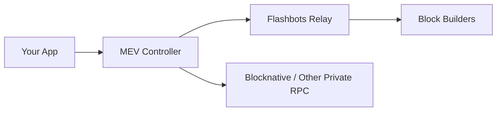

# dart_web3_mev

MEV protection, Flashbots, and high-performance transaction relaying.

## Features

- **Flashbots Support**: Direct submission of transaction bundles to the Flashbots relay.
- **Searcher Tools**: Helpers for detecting and executing arbitrage/liquidation opportunities.
- **Private RPC**: Easily configure private transaction endpoints to avoid public mempool frontrunning.
- **Bundle Optimization**: Calculate optimal miner tips and gas strategies.

## Architecture



## Usage

```dart
import 'package:dart_web3_mev/dart_web3_mev.dart';

void main() async {
  final flashbots = FlashbotsClient(client: myClient);
  
  final bundle = Bundle(txs: [tx1, tx2], blockNumber: targetBlock);
  final response = await flashbots.sendBundle(bundle);
}
```

## Installation

```yaml
dependencies:
  dart_web3_mev: ^0.1.0
```
