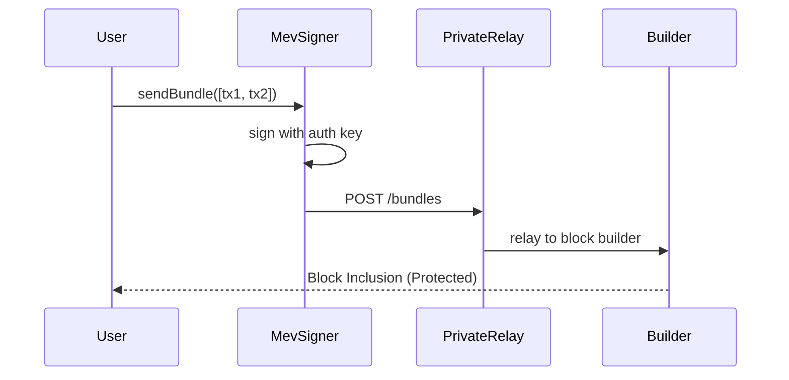
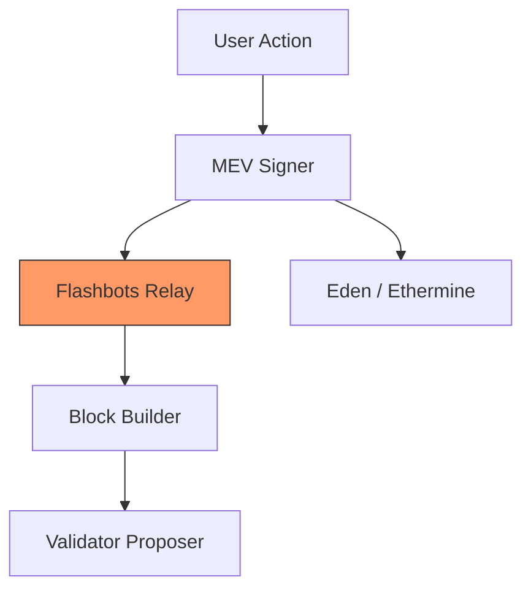

# dart_web3_mev

<!-- Package not yet published to pub.dev -->
[](https://opensource.org/licenses/MIT)

A **protection and arbitrage suite** for Maximal Extractable Value (MEV). Safeguard your users from "sandwich" attacks and front-running by routing transactions through private relays and builders.

## 🚀 Features

- **Private RPC (MEV-Share)**: Route transactions directly to builders (Flashbots, Beaver, Titan).
- **Bundle Builder**: Atomically group transactions for liquidations or arbitrage.
- **Backrun Protection**: Automatically add "refund" hints to your transactions (planned).
- **Relay Registry**: Built-in signatures and metadata for all major Ethereum relays.

## Usage Flow


## 🏗️ Architecture



## 📚 Technical Reference

### Core Classes
| Class | Responsibility |
|-------|----------------|
| `MevRelay` | Client for sending bundles and private transactions to a relay. |
| `Bundle` | A sequenced list of signed transactions and block hints. |
| `FlashbotsSigner` | Utility for adding the required `X-Flashbots-Signature`. |
| `MevProtection` | High-level middleware for the standard `Web3Client`. |

## 🛡️ Security Considerations

- **Private Key Requirement**: Some relays require an "Identification Key" (separate from your wallet) to build a reputation. Keep this key secure.
- **Inclusion Latency**: Private transactions are not broadcast to the public mempool. This might result in slightly slower (1-2 blocks) inclusion times.
- **Failed Inclusions**: Unlike the mempool, bundles that fail will not be included at all (saving gas but potentially harming UX if not handled gracefully).

## 💻 Usage

### Sending a Private Transaction
```dart
import 'package:dart_web3_mev/dart_web3_mev.dart';

void main() async {
  final mev = MevRelay(FlashbotsEndpoints.mainnet);

  final hash = await mev.sendPrivateTransaction(
    signedTx: mySignedTx,
    maxBlockNumber: currentBlock + 5,
  );

  print('Private Tx sent, protected from frontunners!');
}
```

## 📦 Installation

```yaml
dependencies:
  dart_web3_mev: ^0.1.0
```
