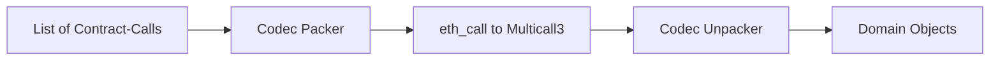

# dart_web3_multicall

<!-- Package not yet published to pub.dev -->
[](https://opensource.org/licenses/MIT)

An **efficiency-focused batching library** that enables querying multiple pieces of blockchain state in a single RPC call. Ideal for complex UIs that need to display balances for numerous tokens or user data across several contracts.

## 🚀 Features

- **RPC Optimization**: dramatically reduces network overhead and latency.
- **Multicall3 Support**: Compatible with the industry-standard `0xcA11bde05977b3631167028862bE2a173976CA11` contract.
- **Aggregate v3**: Supports "allow failures," ensuring one failing call doesn't break the entire batch.
- **Low Gas Consumption**: Optimized encoding for minimized on-chain execution cost.

## Usage Flow
```mermaid
graph TD
    R1[Request 1: Balance] --> B[Batch Aggregator]
    R2[Request 2: Decimals] --> B
    R3[Request 3: Name] --> B
    B --> M[Multicall.aggregate()]
    M --> S[Serialized Call Data]
    S --> Res[Block result]
    Res --> O1[Result 1]
    Res --> O2[Result 2]
    Res --> O3[Result 3]
```

## 🏗️ Architecture



## 📚 Technical Reference

### Core Classes
| Class | Responsibility |
|-------|----------------|
| `Multicall` | The main engine that executes batches. |
| `Multicall3` | Domain specific wrapper for the v3 aggregate functions. |
| `BatchCall` | Represents a single encoded function call within a batch. |
| `CallResult` | Container for success/failure status and decoded return data. |

## 🛡️ Security Considerations

- **Gas Limits**: Extremely large batches (e.g., > 500 calls) might hit the node's `GAS_LIMIT` for `eth_call`. Split very large queries into multiple multicalls.
- **Stale Data**: Remember that all data in a single multicall is atomic to the *same block*. If your app relies on cross-block transitions, handle the block-number metadata accurately.
- **Contract Verify**: In the `Multicall` constructor, ensure the provided address is actually a Multicall3 deployment on your target chain.

## 💻 Usage

### Batching Token Balances (with Failure Tolerance)
```dart
import 'package:dart_web3_multicall/dart_web3_multicall.dart';

void main() async {
  final multicall = Multicall(publicClient: client);

  final batch = [
    dai.call('balanceOf', [user]),
    usdc.call('balanceOf', [user]),
    usdt.call('balanceOf', [user]),
  ];

  // allowFailure: true permits successful results even if one token contract reverts
  final results = await multicall.aggregate3(batch, allowFailure: true);

  for (var res in results) {
    if (res.success) {
       print('Balance: ${res.decoded}');
    }
  }
}
```

## 📦 Installation

```yaml
dependencies:
  dart_web3_multicall: ^0.1.0
```
