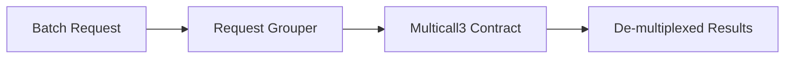

# dart_web3_multicall

Batch multiple contract calls into a single RPC request for efficiency.

## Features

- **Efficiency**: Reduce round-trip latency by grouping up to hundreds of calls.
- **Multicall3 Support**: Compatible with the modern Multicall3 contract (supporting `aggregate3`).
- **Flexible Results**: Handles partial failures within a batch without failing the entire request.
- **Auto-Routing**: Automatically finds the Multicall contract address per chain using `dart_web3_chains`.

## Architecture



## Usage

```dart
import 'package:dart_web3_multicall/dart_web3_multicall.dart';

void main() async {
  final multicall = Multicall(client: myPublicClient);
  
  final results = await multicall.aggregate([
    token.call('balanceOf', [user1]),
    token.call('balanceOf', [user2]),
    client.getBalance(user1),
  ]);
  
  print('Result 1: ${results[0]}');
}
```

## Installation

```yaml
dependencies:
  dart_web3_multicall: ^0.1.0
```
