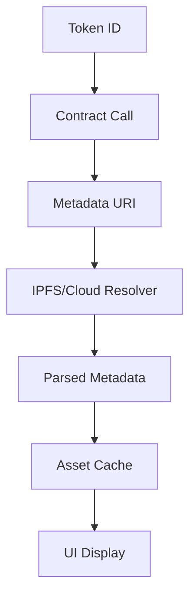
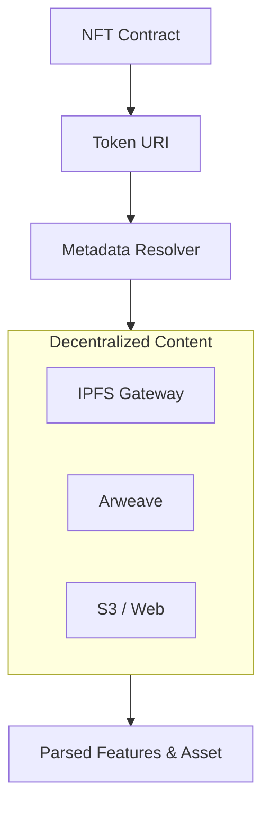

# dart_web3_nft

<!-- Package not yet published to pub.dev -->
[](https://opensource.org/licenses/MIT)

A **comprehensive NFT management suite** for Dart. Easily interact with ERC-721 and ERC-1155 tokens, fetch metadata from decentralized storage, and integrate with marketplaces.

## 🚀 Features

- **Metadata Engine**: Multi-source resolution for IPFS, Arweave, and HTTP metadata.
- **Image Processing**: (Planned) Built-in utilities for handling SVG and responsive NFT media.
- **Marketplace Wrappers**: Specialized modules for OpenSea, Blur, and LooksRare.
- **Ownership Indexing**: Efficiently query all tokens owned by a specific address across collections.

## Usage Flow


## 🏗️ Architecture



## 📚 Technical Reference

### Core Classes
| Class | Responsibility |
|-------|----------------|
| `NftClient` | High-level client for token metadata and ownership. |
| `NftMetadata` | Structured container for name, description, and traits. |
| `Erc721Collection` | Specialized wrapper for ERC-721 contract calls. |
| `IpfsGateway` | Implementation for content-addressed data fetching. |

## 🛡️ Security Considerations

- **Social Engineering**: NFT metadata is often user-controlled. Sanitize all text before display to prevent HTML injection or phishing links in traits.
- **URI Spoofing**: Validate that the `tokenURI` returned by the contract points to a trusted gateway or the expected CID format.
- **Approval Squatting**: Be cautious of "Free Mint" sites that ask for `setApprovalForAll` permissions; always warn users when significant NFT permissions are requested.

## 💻 Usage

### Fetching Metadata for a Token
```dart
import 'package:dart_web3_nft/dart_web3_nft.dart';

void main() async {
  final nft = NftClient(publicClient: client);

  // Fetch standardized metadata for a Bored Ape
  final metadata = await nft.getMetadata(
    contract: '0xBC4CA0EdA7647A8aB7C2061c2E118A18a936f13D',
    tokenId: 1234,
  );

  print('Name: ${metadata.name}');
  print('Image URL: ${metadata.imageUrl}');
  print('Rarity Score: ${metadata.traits['rarity']}');
}
```

## 📦 Installation

```yaml
dependencies:
  dart_web3_nft: ^0.1.0
```
