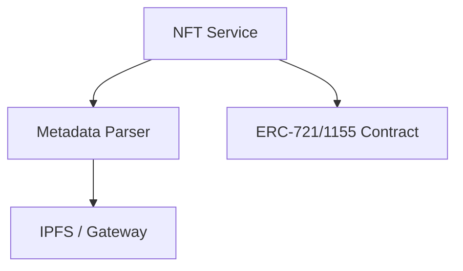

# dart_web3_nft

Non-Fungible Token (NFT) services for the modern decentralized web.

## Features

- **Standard Support**: Full coverage for ERC-721 and ERC-1155 tokens.
- **Metadata Management**: Fetch and parse NFT metadata from IPFS, Arweave, and HTTP.
- **Collection Explorer**: Logic to iterate through NFT holdings of a specific address.
- **Interaction**: easy `mint`, `safeTransferFrom`, and `setApprovalForAll` helpers.

## Architecture



## Usage

```dart
import 'package:dart_web3_nft/dart_web3_nft.dart';

void main() async {
  final bayc = NFTCollection(address: '0x...', client: myClient);
  
  final metadata = await bayc.getMetadata(tokenId: 123);
  print('Name: ${metadata.name}');
  print('Image: ${metadata.imageUrl}');
}
```

## Installation

```yaml
dependencies:
  dart_web3_nft: ^0.1.0
```
