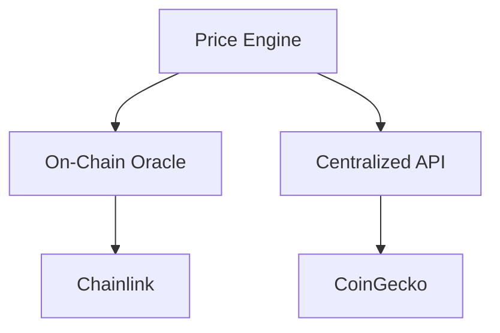

# dart_web3_price

Real-time asset pricing and market data integration for Dart.

## Features

- **Multi-Source**: Fetch prices from CoinGecko, CoinMarketCap, and on-chain DEX oracles.
- **Currency Support**: Support for USD, EUR, BTC, and ETH base currencies.
- **Batch Queries**: Fetch prices for multiple assets in a single call.
- **Refresh Logic**: Automatic price polling and cache invalidation.

## Architecture



## Usage

```dart
import 'package:dart_web3_price/dart_web3_price.dart';

void main() async {
  final price = PriceEngine();
  final ethPrice = await price.getPrice('ethereum');
}
```

## Installation

```yaml
dependencies:
  dart_web3_price: ^0.1.0
```
