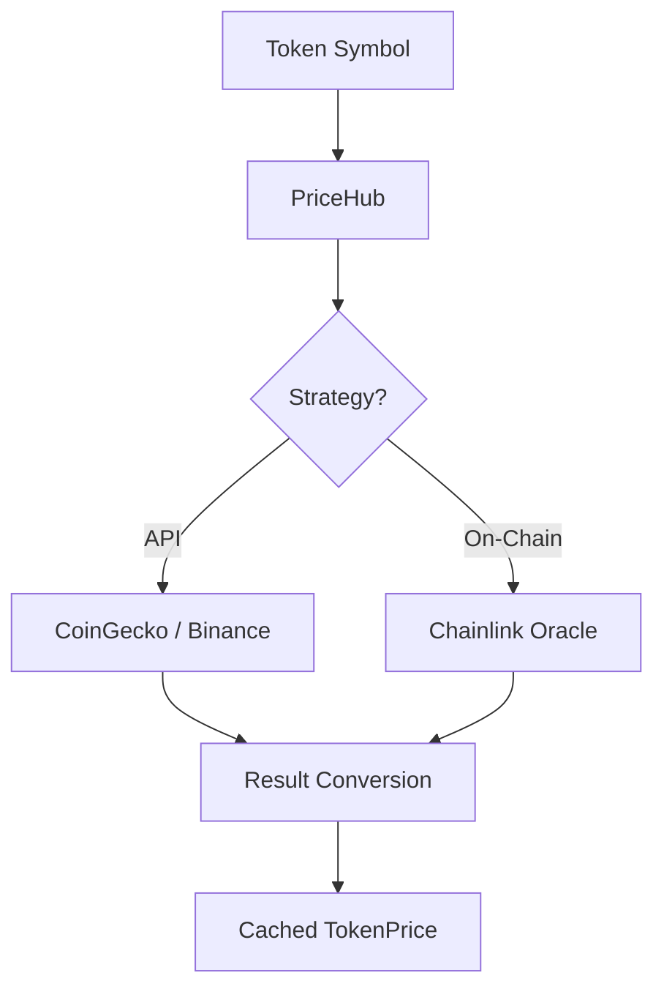
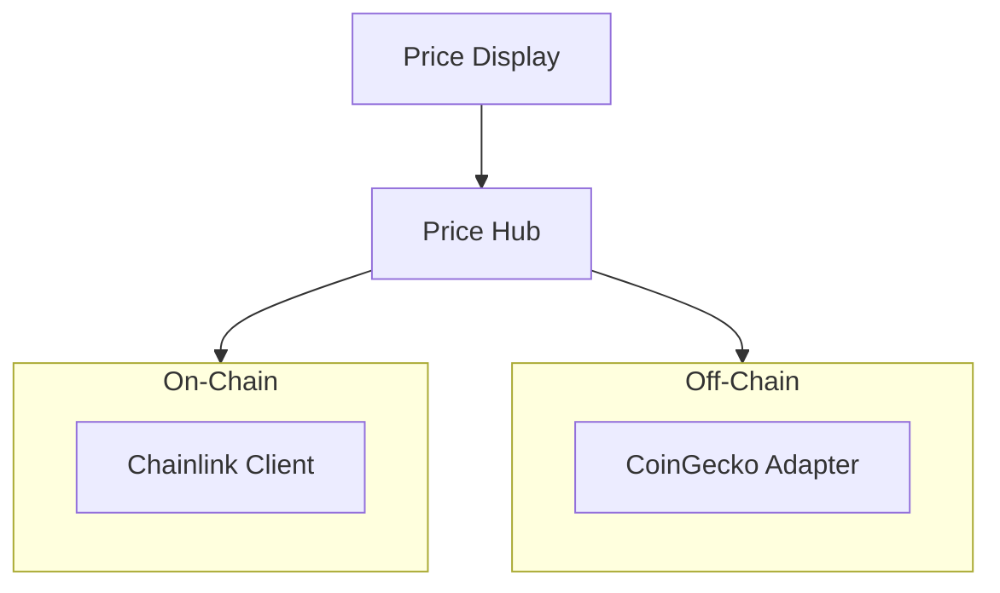

# dart_web3_price

<!-- Package not yet published to pub.dev -->
[](https://opensource.org/licenses/MIT)

A **real-time asset pricing engine** for the Web3 stack. Integrate market data from leading centralized and decentralized sources to provide accurate valuation of crypto assets.

## 🚀 Features

- **Decentralized Oracles**: Direct support for Chainlink and Uniswap V3 TWAP oracles.
- **Centralized APIs**: Native adapters for CoinGecko, CoinMarketCap, and Binance.
- **Precision Mapping**: Maps asset symbols to native Coingecko IDs automatically.
- **Historical Data**: Fetch OHLCV data for charts and portfolio analysis (planned).

## Usage Flow


## 🏗️ Architecture



## 📚 Technical Reference

### Core Classes
| Class | Responsibility |
|-------|----------------|
| `PriceHub` | The main interface for fetching and caching asset prices. |
| `PriceSource` | Abstract interface for implementing new data providers. |
| `TokenPrice` | Container for price, timestamp, and source metadata. |
| `CurrencyCode` | (Enum) Supported fiat and crypto base denominations. |

## 🛡️ Security Considerations

- **Oracle Manipulation**: On-chain prices can be manipulated via flash loans. Always use TWAP or decentralized aggregators for critical DeFi logic.
- **Fallback Logic**: API-based pricing can go down. The SDK allows setting primary and fallback sources to ensure UI continuity.
- **Staleness Threshold**: Check the `timestamp` of the returned price. In production, reject prices older than 5-10 minutes for active trading components.

## 💻 Usage

### Multi-Source Price Fetching
```dart
import 'package:dart_web3_price/dart_web3_price.dart';

void main() async {
  final hub = PriceHub(primary: CoinGeckoSource());

  // Fetch ETH price in USD
  final price = await hub.getPrice(asset: 'ethereum', currency: 'usd');
  
  print('Current Price: $${price.value}');
  print('Source: ${price.sourceName}');
}
```

## 📦 Installation

```yaml
dependencies:
  dart_web3_price: ^0.1.0
```
