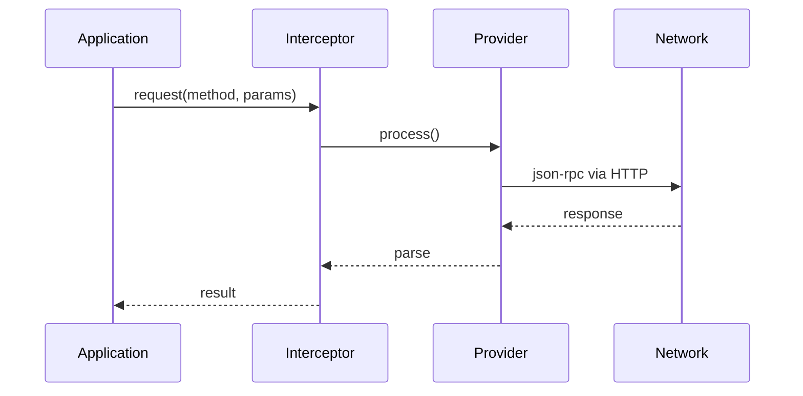
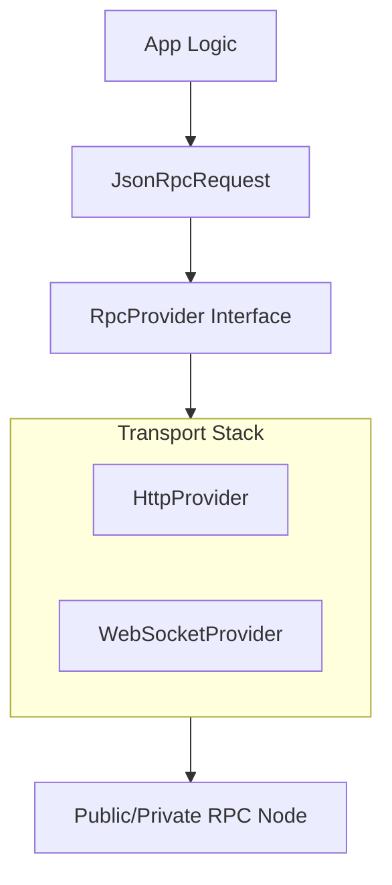

# dart_web3_provider

[](https://pub.dev/packages/dart_web3_provider)
[](https://opensource.org/licenses/MIT)

The **connectivity gateway** for the Dart Web3 SDK. It provides a standardized interface for sending JSON-RPC requests to blockchain nodes via various transport protocols.

## 🚀 Features

- **JSON-RPC 2.0 Compliant**: Full support for the standard batching and error specifications.
- **Transport Flexibility**: Implementations for HTTP, with hooks for WebSockets and custom IPC.
- **Advanced Middleware**: Inject custom logic for request signing, rate limiting, or verbose logging.
- **Fail-over Capability**: (Planned) Logic to automatically switch between RPC endpoints.

## Usage Flow


## 🏗️ Architecture



## 📚 Technical Reference

### Core Classes
| Class | Responsibility |
|-------|----------------|
| `RpcProvider` | Abstract interface for request execution. |
| `HttpProvider` | Default implementation using `dart:http`. |
| `JsonRpcResponse` | Structured container for results or RPC errors. |
| `RpcInterceptor` | Base class for building provider middleware. |

## 🛡️ Security Considerations

- **SSL/TLS**: Always use `https://` or `wss://` for production RPC endpoints to prevent MITM attacks.
- **Sensitive Data in Headers**: When using custom auth headers, ensure the provider instance is not exposed to untrusted parts of the application.
- **Rate Limit Handling**: Implement exponential backoff in middleware to handle `429 Too Many Requests` gracefully.

## 💻 Usage

### Provider with Logging Interceptor
```dart
import 'package:dart_web3_provider/dart_web3_provider.dart';

class LoggerInterceptor extends RpcInterceptor {
  @override
  void onRequest(JsonRpcRequest request) {
    print('RPC Call: ${request.method}');
  }
}

void main() async {
  final provider = HttpProvider('https://mainnet.infura.io/v3/...')
    ..addInterceptor(LoggerInterceptor());
    
  final block = await provider.request('eth_blockNumber', []);
  print('Result: $block');
}
```

## 📦 Installation

```yaml
dependencies:
  dart_web3_provider: ^0.1.0
```
