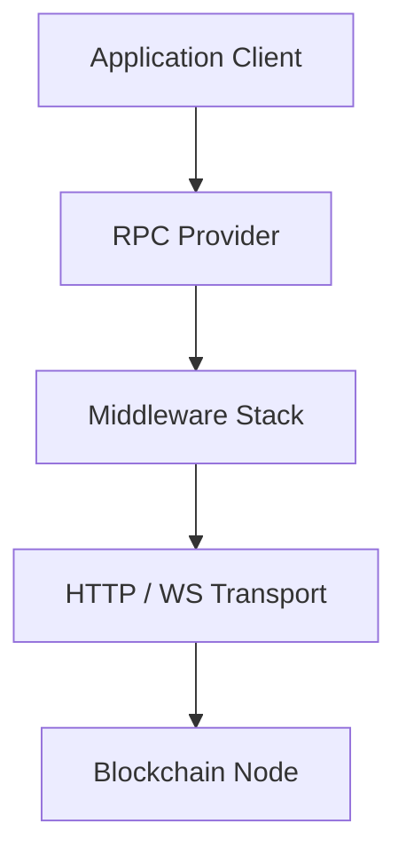

# dart_web3_provider

Web3 RPC Provider layer for connecting Dart applications to blockchain nodes.

## Features

- **Transport Agnostic**: Clean interface for implementing custom transport layers.
- **HTTP/HTTPS**: Robust JSON-RPC support over HTTP.
- **WebSocket**: (In Progress) Subscriptions and real-time event streaming.
- **Middleware**: Intercept requests to add authentication headers, logging, or retry logic.
- **Error Normalization**: Maps complex RPC errors to predictable Dart exceptions.

## Architecture



## Usage

### Basic HTTP Request
```dart
import 'package:dart_web3_provider/dart_web3_provider.dart';

void main() async {
  final provider = HttpProvider('https://eth.llamarpc.com');
  
  final response = await provider.request('eth_blockNumber', []);
  if (response.hasError) {
    print('Error: ${response.error!.message}');
  } else {
    print('Current Block: ${response.result}');
  }
}
```

## Installation

```yaml
dependencies:
  dart_web3_provider: ^0.1.0
```
