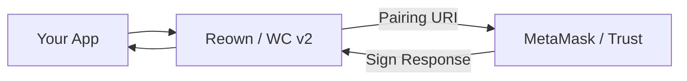

# dart_web3_reown

Secure application pairing using the Reown (WalletConnect v2) protocol.

## Features

- **Session Lifecycle**: Establish, persist, and terminate secure sessions with mobile wallets.
- **Multi-Chain Pairing**: Request permissions for multiple networks simultaneously.
- **Signing Delegate**: Seamlessly routes signing requests from `dart_web3_client` to the linked wallet.
- **Relay System**: Uses the production Reown relay infrastructure for global connectivity.

## Architecture



## Usage

```dart
import 'package:dart_web3_reown/dart_web3_reown.dart';

void main() async {
  final reown = ReownClient(projectId: 'YOUR_PROJECT_ID');
  
  reown.onSessionProposal.listen((proposal) {
    // Handle pairing UI
  });
}
```

## Installation

```yaml
dependencies:
  dart_web3_reown: ^0.1.0
```
