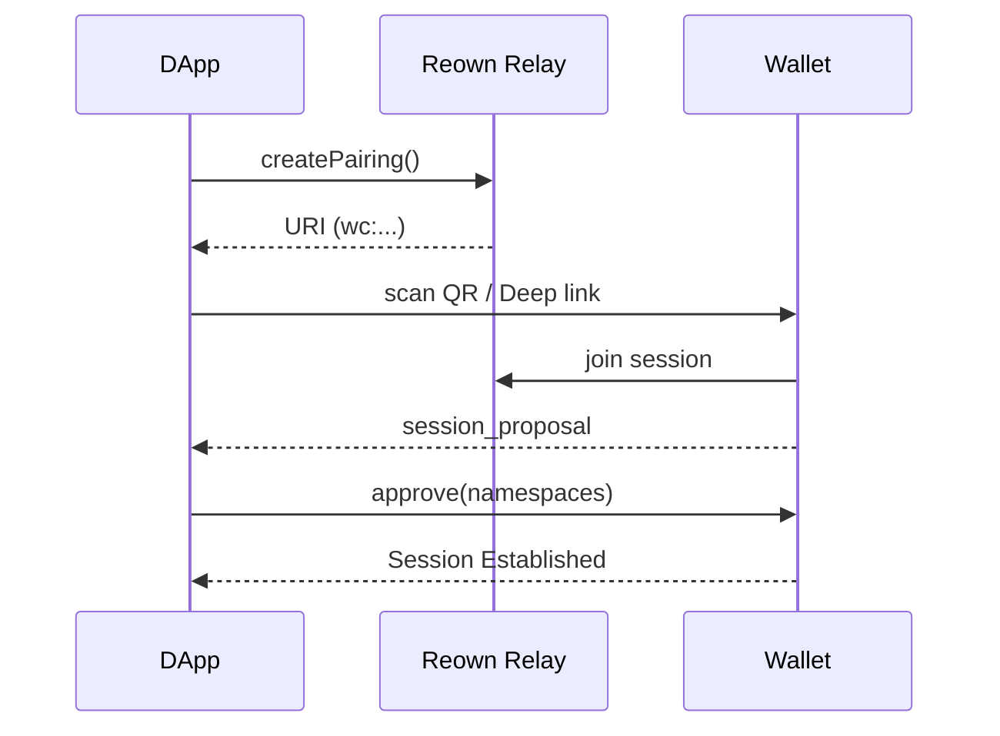
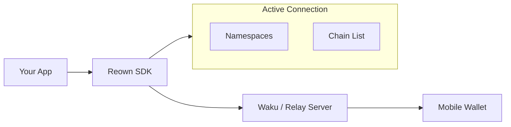

# dart_web3_reown

[](https://pub.dev/packages/dart_web3_reown)
[](https://opensource.org/licenses/MIT)

A **seamless WalletConnect (Reown) v2 integration** for Dart. Connect your decentralized application (dApp) to hundreds of mobile and browser wallets with a single protocol.

## 🚀 Features

- **v2 Protocol Support**: Full compliance with decentralized pairing and session management.
- **Multi-Chain Pairing**: Request permissions for multiple chains and methods in a single session.
- **Relay Infrastructure**: High-performance connection management via Reown's global relayers.
- **UI Hooks**: Built-in state observables for connection status, session events, and proposed namespaces.

## Usage Flow


## 🏗️ Architecture



## 📚 Technical Reference

### Core Classes
| Class | Responsibility |
|-------|----------------|
| `ReownClient` | The main controller for pairing and session lifecycle. |
| `Pairing` | Represents a persistent connection between DApp and Wallet. |
| `Session` | Represents an active authorization to sign for specific accounts. |
| `Proposal` | Incoming or outgoing request to start a new session. |

## 🛡️ Security Considerations

- **Project ID Exposure**: While the Project ID is public, implement domain-whitelisting in the Reown Dashboard to prevent unauthorized apps from using your relay quota.
- **Deep Link Handling**: Ensure your application correctly handles OS-level deep links to prevent session hijacking via malicious link interceptors.
- **Disconnect Logic**: Always provide a clear "Disconnect" button that calls `reown.disconnect()` to purge local session data and notify the relay.

## 💻 Usage

### Initializing and Pairing
```dart
import 'package:dart_web3_reown/dart_web3_reown.dart';

void main() async {
  final reown = ReownClient(projectId: 'YOUR_PROJECT_ID');
  await reown.init();

  // Create a pairing URI
  final pairingUri = await reown.createPairing();
  
  // Display this as a QR code or deep link
  print('Connect here: $pairingUri');

  reown.onSessionEvent.listen((event) {
    print('New Session Created: ${event.topic}');
  });
}
```

## 📦 Installation

```yaml
dependencies:
  dart_web3_reown: ^0.1.0
```
