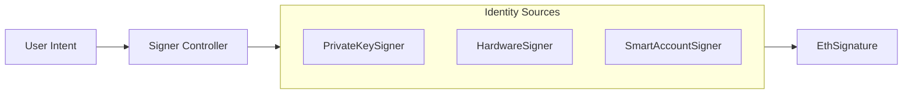

# dart_web3_signer

[](https://pub.dev/packages/dart_web3_signer)
[](https://opensource.org/licenses/MIT)

A **universal signing abstraction** for the Dart Web3 ecosystem. It decouples identity management from execution logic, supporting local, hardware, and remote signing workflows.

## 🚀 Features

- **Unified Signer Protocol**: One interface for all signing methods (EOA, MPC, HW).
- **EIP-712 Support**: Domain-separated, typed data signing for human-readable approvals.
- **Hardware Integration**: High-level hooks for Ledger, Trezor, and Keystone devices.
- **Message Standards**: Built-in support for `personal_sign` and Ethereum-prefixed message hashing.

## 🏗️ Architecture



## 📚 Technical Reference

### Core Classes
| Class | Responsibility |
|-------|----------------|
| `Signer` | The core interface for and account-bound signing. |
| `PrivateKeySigner` | Local in-memory signer using raw ECDSA. |
| `TypedData` | EIP-712 structure representation. |
| `EthSignature` | Container for `v`, `r`, `s` components of a signature. |

## 🛡️ Security Considerations

- **Key Isolation**: Keep `PrivateKeySigner` instances confined to the narrowest possible scope. Never share them across thread boundaries if possible.
- **Approval Verification**: When using `signTypedData`, always display the parsed JSON in the UI for the user to verify before calling the signer.
- **Hardware Timeouts**: Implement proper timeout handling when interacting with hardware signers (Level 6) to avoid app freezes.

## 💻 Usage

### Signing EIP-712 Typed Data
```dart
import 'package:dart_web3_signer/dart_web3_signer.dart';

void main() async {
  final signer = PrivateKeySigner.fromHex('0x...', 1);
  
  final data = TypedData(
    domain: TypedDataDomain(name: 'MyDapp', version: '1'),
    types: {...},
    primaryType: 'Mail',
    message: {'contents': 'Hello!'},
  );

  final signature = await signer.signTypedData(data);
  print('Signature: ${signature.toHex()}');
}
```

## 📦 Installation

```yaml
dependencies:
  dart_web3_signer: ^0.1.0
```
