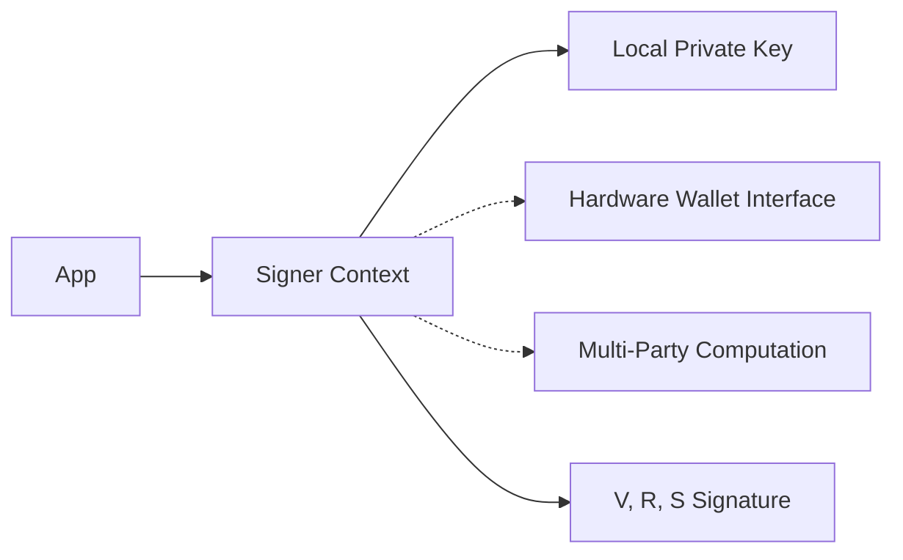

# dart_web3_signer

Identity and signing abstractions for authorizing blockchain actions.

## Features

- **统一 Signer 接口**: High-level interface compatible with local and remote signers.
- **PrivateKeySigner**: Fast, local signing using `dart_web3_crypto`.
- **EIP-712**: Typed data signing for safer user interactions.
- **Message Signing**: Support for `eth_sign`, `personal_sign`, and `eth_signTypedData_v4`.
- **Hardware Ready**: Abstract base classes for Ledger, Trezor, and Keystone integrations.

## Architecture



## Usage

### Local Signing
```dart
import 'package:dart_web3_signer/dart_web3_signer.dart';

void main() async {
  final signer = PrivateKeySigner.fromHex('0x...', 1); // ChainID: 1
  
  // Sign a simple message
  final sig = await signer.signMessage("Log in to my dApp");
  print('Signature: $sig');
}
```

## Installation

```yaml
dependencies:
  dart_web3_signer: ^0.1.0
```
