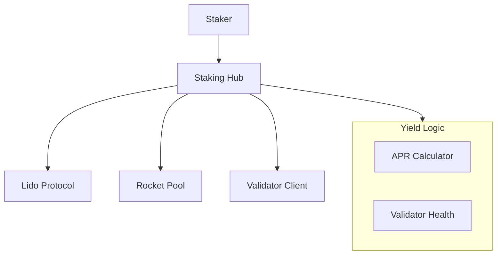

# dart_web3_staking

[](https://pub.dev/packages/dart_web3_staking)
[](https://opensource.org/licenses/MIT)

A **liquid and native staking integrator** for Dart. Simplify the complexity of staking assets, claiming rewards, and managing validator delegations through a unified API.

## 🚀 Features

- **Liquid Staking Support**: Built-in adapters for Lido (stETH), Rocket Pool (rETH), and Frax.
- **Native Delegation**: (In development) Support for native Beacon Chain staking and Cosmos-sdk based chains.
- **Reward Tracking**: Real-time calculation of APR/APY across different protocols.
- **Auto-Compounding**: Logic to automatically claim and re-stake rewards where supported.

## 🏗️ Architecture



## 📚 Technical Reference

### Core Classes
| Class | Responsibility |
|-------|----------------|
| `StakingHub` | Main registry for all supported staking protocols. |
| `StakingPosition` | Represents a user's current stake, rewards, and unlock time. |
| `LidoAdapter` | Specific logic for interacting with Lido's contract suite. |
| `YieldInfo` | Container for historical and projected yield data. |

## 🛡️ Security Considerations

- **Slashing Risk**: Native staking involves risk if validators misbehave. Always display Slash Protection status in production UIs.
- **Lock-up Periods**: Staking often involves multi-day unbonding periods. Ensure the UI clearly communicates "Locked Assets" to prevent user confusion.
- **Protocol Risk**: Use protocols with high TVL and multiple audits. The SDK provides pointers to official protocol documentation; users should review these before staking large amounts.

## 💻 Usage

### Staking ETH with Lido
```dart
import 'package:dart_web3_staking/dart_web3_staking.dart';

void main() async {
  final hub = StakingHub(publicClient: client);
  final lido = LidoAdapter();

  // Get current APR
  final apr = await hub.getApr(lido);
  print('Lido APR: ${apr.percentage}%');

  // Stake ETH
  final tx = await hub.stake(
    protocol: lido,
    amount: EthUnit.ether('1.0'),
    signer: mySigner,
  );
}
```

## 📦 Installation

```yaml
dependencies:
  dart_web3_staking: ^0.1.0
```
