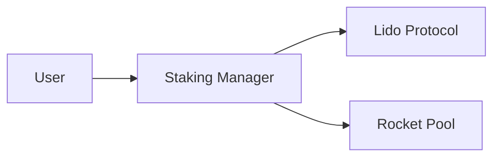

# dart_web3_staking

Liquid and native staking service integrations.

## Features

- **Integration**: Native support for Lido (stETH) and Rocket Pool (rETH).
- **Yield Calculation**: Track real-time APR/APY for various staking strategies.
- **Staking Actions**: Simplified `stake`, `unstake`, and `claim` flows.
- **Validator Tools**: (Planned) Helpers for individual node operators.

## Architecture



## Usage

```dart
import 'package:dart_web3_staking/dart_web3_staking.dart';

void main() async {
  final lido = LidoProvider(client: myClient);
  
  final apr = await lido.getCurrentAPR();
  print('Lido APR: $apr%');
}
```

## Installation

```yaml
dependencies:
  dart_web3_staking: ^0.1.0
```
