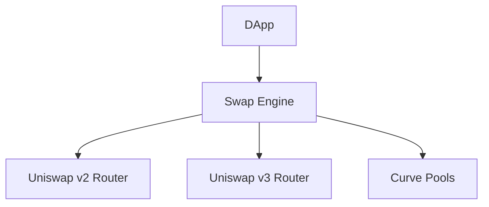

# dart_web3_swap

DEX Aggregator and decentralized exchange integration layer.

## Features

- **Protocol Aggregation**: Unified interface for Uniswap, Curve, Balancer, and PancakeSwap.
- **Smart Routing**: (Planned) Logic to find the best price across multiple liquidity sources.
- **Quote Management**: Fetch real-time price quotes and slippage calculations.
- **Execution**: Helper methods to execute `swapExactTokensForTokens` and similar flows.

## Architecture



## Usage

```dart
import 'package:dart_web3_swap/dart_web3_swap.dart';

void main() async {
  final uniswap = UniswapClient(client: myPublicClient);
  
  final quote = await uniswap.getQuote(
    from: TokenInfo.ETH,
    to: TokenInfo.USDC,
    amount: EthUnit.ether('1'),
  );
  
  print('Output: ${quote.amountOut}');
}
```

## Installation

```yaml
dependencies:
  dart_web3_swap: ^0.1.0
```
