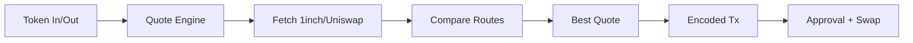
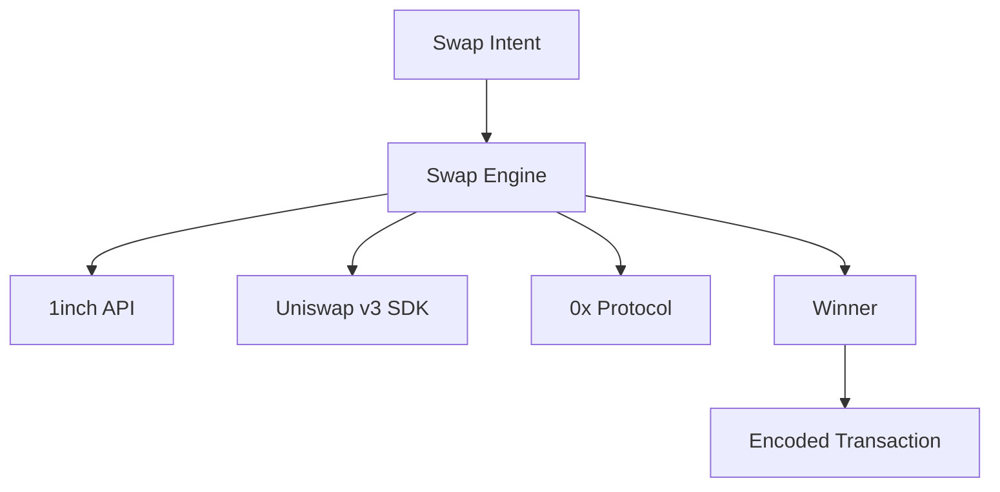

# dart_web3_swap

[](https://pub.dev/packages/dart_web3_swap)
[](https://opensource.org/licenses/MIT)

A **unified DEX aggregation layer** for Dart. Perform asset swaps, fetch liquidity quotes, and interact with numerous decentralized exchanges (Uniswap, PancakeSwap, 1inch) through a single interface.

## 🚀 Features

- **Smart Route Discovery**: Connect to aggregators to find the best price across multiple liquidity pools.
- **Price Impact Analysis**: Pre-calculate slippage and impact to protect user funds.
- **Protocol Support**: Specialized modules for Uniswap v2/v3, Curve, and Balancer.
- **Atomic Operations**: Bundle approval and swap transactions where the protocol supports it.

## Usage Flow


## 🏗️ Architecture



## 📚 Technical Reference

### Core Classes
| Class | Responsibility |
|-------|----------------|
| `SwapEngine` | Orchestrates quote fetching from multiple sources. |
| `SwapQuote` | Container for price, path, slippage, and execution data. |
| `TokenPair` | Helper for managing source and destination asset metadata. |
| `Slippage` | Type-safe representation of tolerated price variance. |

## 🛡️ Security Considerations

- **Slippage Protection**: Never hardcode slippage to 0%. Always allow for a reasonable buffer (e.g., 0.5% - 1.0%) to prevent transaction reverts in volatile markets.
- **Infinite Approval Risk**: Only approve the exact amount needed for a swap if your threat model involves high-risk or un-audited protocols.
- **MEV Awareness**: For large swaps, use modules like `dart_web3_mev` to route transactions through private builders and avoid front-running.

## 💻 Usage

### Fetching a Quote from 1inch
```dart
import 'package:dart_web3_swap/dart_web3_swap.dart';

void main() async {
  final engine = SwapEngine(apiKey: '...');
  
  final quote = await engine.getQuote(
    fromToken: '0x...', // USDC
    toToken: '0x...',   // ETH
    amount: EthUnit.parseUnit('100', 6),
    slippage: 0.01, // 1%
  );

  print('Estimated Return: ${quote.toTokenAmount}');
  print('Transaction Required: ${quote.txData}');
}
```

## 📦 Installation

```yaml
dependencies:
  dart_web3_swap: ^0.1.0
```
